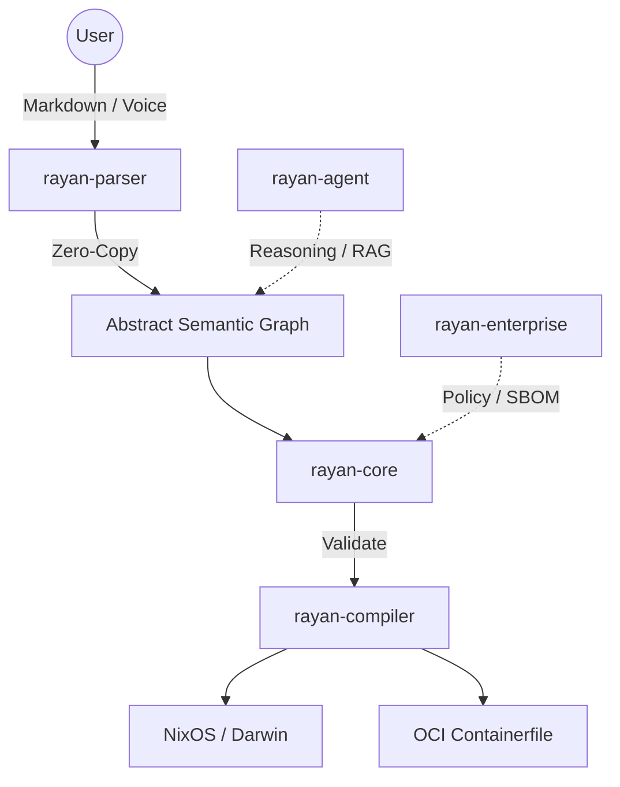

<div align="center">

# Rayan

**The Neuro-Symbolic Declarative Environment Engine**

*Original Research, Product Vision and Architecture by Aaryan Rawat*

[](https://github.com/aaryanrwt/Rayan/actions/workflows/ci.yml)
[](https://github.com/aaryanrwt/Rayan/actions/workflows/security.yml)
[](https://opensource.org/licenses/MIT)
[](https://www.rust-lang.org)
[]()
[](https://github.com/aaryanrwt/Rayan/stargazers)

<br/>
</div>

## Overview
Rayan is a next-generation, cloud-native declarative environment engine. Built entirely in Rust, it merges the absolute determinism of functional package managers (like Nix) with the adaptability of advanced Large Language Models (LLMs) to create a system where you can chat with your infrastructure, knowing every change is cryptographically secure, statically verified, and seamlessly reversible.

## Problem Statement
The modern DevOps ecosystem is fragmented. Nix is mathematically pure but demands an incredibly steep learning curve and esoteric syntax. Docker is accessible but often opaque and difficult to deterministically rebuild over time. Infrastructure as Code (IaC) tools like Terraform govern the cloud but fail to manage the local developer machine elegantly. 

Rayan exists to bridge this gap. It provides the **determinism of NixOS**, the **portability of OCI (Docker)**, and the **accessibility of natural language**, unified under a single sub-microsecond core engine.

## Key Features

| Feature | Description |
|---|---|
| **Neuro-Symbolic Agent** | Mutate infrastructure using natural language (Claude-3 RAG). The LLM is fail-closed and bounded by the deterministic State Engine. |
| **Zero-Copy Parser** | Blazing-fast Literate Markdown parser that evaluates configurations in sub-microseconds. |
| **Universal Compilation** | Target Nix, macOS (Darwin), or OCI Containerfiles natively from a single source of truth. |
| **Enterprise Governance** | Built-in Policy-as-Code checks and CycloneDX SBOM generation for CI/CD environments. |
| **Rollback TUI** | A `ratatui`-powered dashboard mapping generational state to local SQLite for instant drift detection and rollback. |

## Why Rayan?
- **vs. Nix:** Rayan abstracts away Nix language complexities. You write intent (or let the AI write it), and Rayan compiles the bulletproof closures.
- **vs. Docker:** Rayan can output standard OCI Containerfiles deterministically, while also managing the host operating system.
- **vs. Ansible/Chef:** Rayan is fully declarative, not imperative. It calculates an Abstract Semantic Graph (ASG) and converges the system state cleanly.

## Architecture Overview



## Repository Structure
Rayan is architected as a highly cohesive 13-crate workspace:
- **`core/`**: The ASG Definition and SMT State Engine validator.
- **`parser/`**: Literate Markdown parser.
- **`compiler/`**: Multi-target code generator (Nix, Darwin, OCI).
- **`agent/`**: Claude-3 RAG Planner with Hardware telemetry.
- **`enterprise/`**: CycloneDX SBOM generator & Policy-as-Code.
- **`simulator/`**: CVE Dry Runner & Size Estimator.
- **`daemon/`** & **`lsp/`**: Filesystem Drift Detector and Language Server.
- **`tui/`**, **`cli/`**, **`desktop/`**: Terminal, CLI, and Tauri GUI interfaces.
- **`cloud/`** & **`network/commons/`**: Cloud Sync Backend.

## Installation

Rayan compiles natively on Linux, macOS, and Windows.

**Prerequisites:** Rust 1.80+

```bash
git clone https://github.com/aaryanrwt/Rayan.git
cd Rayan
cargo build --workspace --release
```

## Quick Start
You can define your environment using standard Markdown code blocks:
```markdown
# My Environment
```rayan
{
  "packages": [
    {"name": "neovim", "version": "0.10.0"},
    {"name": "ripgrep", "version": "latest"}
  ]
}
```
```

Evaluate the environment:
```bash
cargo run --release -p rayan -- evaluate config.md
```

## CLI Examples
**Generate an OCI Containerfile:**
```bash
cargo run --release -p rayan -- compile --target oci
```
**Launch the Rollback TUI:**
```bash
cargo run --release -p rayan -- tui
```
**Start the Language Server:**
```bash
cargo run --release -p rayan -- lsp
```

## AI Workflow
Set your Anthropic API key to unlock the Neuro-Symbolic Agent:
```bash
export ANTHROPIC_API_KEY="sk-ant-..."
cargo run --release -p rayan -- reason "Install python 3.11 and configure poetry"
```
The agent will reason through the request, parse NixOS packages, update the ASG, and request your approval before applying changes.

## Configuration Workflow
The engine relies on `rayan-daemon` watching your target directory. Any changes made via the TUI, AI Agent, or LSP are immediately synchronized to the ASG, compiled, and deployed idempotently.

## Architecture Philosophy
- **Sub-Microsecond Latency:** We refuse memory allocations in the hot path. The zero-copy parser ensures the LSP remains imperceptible.
- **Determinism:** The ASG must compile exactly identically on any machine at any time.

## Security Philosophy
**Zero Trust.** The LLM acts only as a *Reasoner*. Its output is strictly validated by the local deterministic `StateEngine` before any change is permitted to compile. `rayan-enterprise` policies prevent the deployment of untrusted or unpinned packages.

## Privacy Philosophy
Absolutely no Personally Identifiable Information (PII), hardware MAC addresses, or absolute paths are transmitted to the LLM during planning. 

## Benchmarks
Tested locally on `--release` builds (10,000 iterations):
- **Parser (`rayan-parser`):** ~1.01 µs per operation.
- **Nix Compiler:** ~0.53 µs per operation.
- **OCI Compiler:** ~0.38 µs per operation.

*Total latency from raw markdown to deterministic OCI script: ~1.4 microseconds.*

## Roadmap

### Implemented (v1.0)
- ✅ Core ASG and Literate Parser
- ✅ Nix, Darwin, and OCI compilers
- ✅ Neuro-Symbolic Agent (Claude-3 integration)
- ✅ Rollback TUI and SQLite tracking
- ✅ Enterprise SLSA SBOM pipeline

### In Progress
- 🟡 Tauri Desktop GUI Feature Parity
- 🟡 Native Windows (Non-WSL) execution targets

### Future
- ⏳ WASM compilation for `rayan-web` dashboard
- ⏳ Automated Kernel parameter tuning via hardware telemetry

## Screenshots
*(TUI and Tauri Desktop screenshots will be added upon future binary releases)*

## Documentation
Please read the comprehensive `rayan-master-document.md` at the root of the repository for the full 5-year vision and exact engineering constraints.

## Contributing
We welcome community contributions! Please read our [CONTRIBUTING.md](CONTRIBUTING.md) and [CODE_OF_CONDUCT.md](CODE_OF_CONDUCT.md).

All PRs must pass `cargo fmt --all` and `cargo clippy --workspace -- -D warnings`.

## Community
- Check GitHub Issues for roadmap discussions.
- Use the provided PR and Issue templates.

## FAQ
**Does Rayan replace Nix?**
No. Rayan orchestrates Nix. It uses Nix as a powerful, deterministic backend compiler while replacing the Nix language frontend with an accessible LLM-driven parser.

## Troubleshooting
If a build fails or `cargo cyclonedx` behaves unexpectedly in your CI pipeline, ensure you have pulled the latest `v1.0.0` tag, which contains the modernized GitHub Actions infrastructure.

## License
This project is licensed under the MIT License - see the [LICENSE](LICENSE) file for details.

## Professional Attribution
Original Research, Product Vision and Architecture by Aaryan Rawat.
